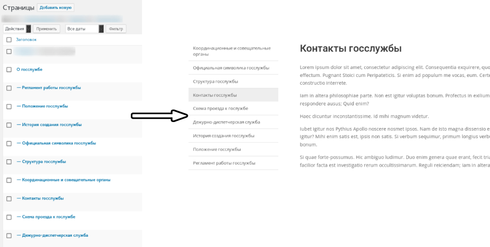

# Wordpress Shortcode to display parent (or self) child pages



**Usage:**
1. Copy code from [functions.php](functions.php) and past it to your active theme-s folder functions.php file
2. Use shortcode in text or in theme files with do_shortcode() function.

**Examples:**

In text:
```
[list_of_pages [param_name="value_name", ...] ]
```
In theme files:
```
<?php
  if (shortcode_exists('list_of_pages')) {
    do_shortcode('[list_of_pages [param_name="value_name", ...] ]');
  }
?>
```

**Available parameters - (type) description:**
- **theme** - (string) html custom theme
- **pre_code** - (string) html code, that comes before theme
- **post_code** - (string) html code, that comes after theme
- **widget_title** - (string) title of widget
- **widget_pre_title** - (string) html code, that comes before widget title
- **widget_post_title** - (string) html code, that comes after widget title
- **link_target** - (string) open page in current/new tab
- **if_active** - (string) class name, if menu item is active
- **if_null_return** - (string) return message, if no child pages found
- **order_by** - (string) order pages by field
- **order** - (string) ASC or DESC order

**Pre-defined values for parameters:**
- **theme** ```<li id="lof_page_{page_id}" class="lof_page {page_active_class}"><a href="{link}" target="{link_target}">{title}</a></li>```
- **pre_code** ```<ul class="list_of_pages">```
- **post_code** ```</ul>```
- **widget_pre_title** ```<h4 class="widgettitle">```
- **widget_post_title** ```</h4>```
- **widget_title** -      ```null```
- **link_target** -       ```_self```
- **if_active** -         ```lof_page_active```
- **if_null_return**  -   ```null```
- **order_by** - ```menu_order```
- **order** - ```ASC```

**TODO:**
- **Show parent**
- ~~Add order parameters~~
